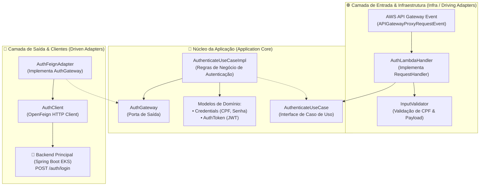
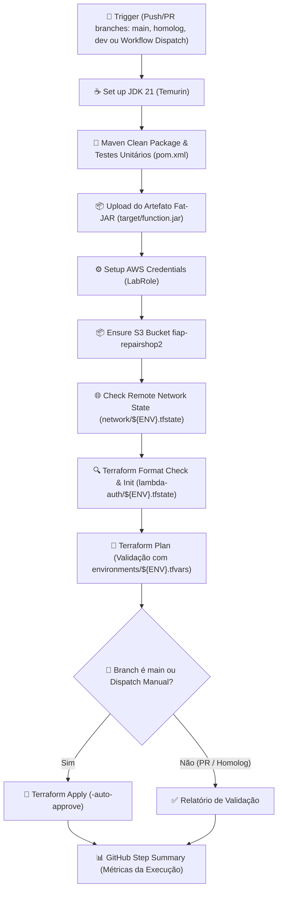

# ⚡ RepairShop — Microsserviço Serverless de Autenticação (AWS Lambda Java 21)

[](https://openjdk.org/)
[](https://aws.amazon.com/lambda/)
[](https://blog.cleancoder.com/uncle-bob/2012/08/13/the-clean-architecture.html)
[](https://github.com/OpenFeign/feign)
[](https://www.terraform.io/)
[](https://github.com/features/actions)

Repositório da **Função Serverless (AWS Lambda)** em **Java 21**, desenvolvida sob os preceitos de **Clean Architecture (Arquitetura Limpa / Hexagonal)**, responsável pela validação defensiva de credenciais (CPF), verificação de status do cliente e emissão de tokens JWT para o ecossistema **RepairShop** (FIAP Tech Challenge — Fase 3).

---

## 🎯 Propósito e Escopo Arquitetural

Conforme especificado no edital da Fase 3, a autenticação de clientes e operadores foi desacoplada em uma solução Serverless independente para prover:

- **Autenticação via CPF:** Validação estrita de formato e dígito verificador do CPF antes de qualquer chamada downstream.
- **Consulta e Emissão de Token JWT:** A Lambda atua como intermediário seguro, validando as credenciais e emitindo o token assinado necessário para consumo das rotas protegidas da API principal.
- **Isolamento de Infraestrutura e Rede:** A função Lambda é provisionada em sub-redes privadas da VPC com Security Group próprio (`aws_security_group.lambda_sg`), permitindo tráfego de saída controlado.
- **Respostas Padronizadas com Headers OWASP:** Todas as respostas contêm headers de proteção (`Strict-Transport-Security`, `X-Content-Type-Options`, `X-Frame-Options`, `Cache-Control`).

---

## 🏗️ Arquitetura de Software (Clean Architecture / Hexagonal)

A aplicação segue a divisão em camadas independentes de frameworks externos:



---

## 📋 Contrato da API (`POST /auth/login`)

### Exemplo de Payload de Requisição
```json
{
  "cpf": "123.456.789-00",
  "password": "SenhaSegura123!"
}
```

### Exemplo de Resposta de Sucesso (`200 OK`)
```json
{
  "token": "eyJhbGciOiJIUzI1NiIsInR5cCI6IkpXVCJ9...",
  "type": "Bearer",
  "expiresIn": 86400,
  "cpf": "12345678900"
}
```

---

## 🗂️ Estrutura de Arquivos

```text
.
├── .github/workflows/
│   ├── ci-cd-lambda.yml      # Pipeline de CI/CD (Build Java, Testes e Deploy Terraform)
│   └── destroy.yml           # Pipeline de destruição controlada com Safety Gate
├── infra/
│   ├── main.tf               # Definição da AWS Lambda, Security Group e IAM Roles
│   ├── variables.tf          # Variáveis de ambiente, timeout e memória
│   ├── outputs.tf            # Export de Lambda ARN, Name e SG ID
│   ├── providers.tf          # Configuração do provedor AWS
│   ├── backend.tf            # Configuração do backend remoto S3
│   └── environments/
│       ├── dev.tfvars        # Configurações de Dev
│       ├── hml.tfvars        # Configurações de Homolog
│       └── prd.tfvars        # Configurações de Produção
├── src/
│   ├── main/java/com/cao/repairshop/auth/
│   │   ├── application/      # UseCases, Interfaces de Gateway e Regras
│   │   ├── domain/           # Entidades, Models e Exceptions
│   │   └── infra/            # Handlers Lambda, Validadores e Clientes Feign
│   └── test/java/            # Testes Unitários e Runner Local
├── pom.xml                   # Dependências e configuração do maven-shade-plugin
└── README.md
```

---

## 🚀 Pipeline de CI/CD (GitHub Actions)

A esteira automatizada está configurada em [`.github/workflows/ci-cd-lambda.yml`](.github/workflows/ci-cd-lambda.yml).

### Desenho da Pipeline CI/CD



### Detalhamento e Justificativa de Cada Passo da Pipeline

| Passo | Ação Executada | Justificativa Arquitetural |
| :--- | :--- | :--- |
| **1. Set up JDK 21** | Configura o ambiente Java 21 (Temurin) com cache do Maven. | Reduz o tempo de download de dependências e garante conformidade de compilação. |
| **2. Compile and Test Application** | Executa `mvn clean package -B -ntp` rodando toda a suíte de testes unitários. | Garante que código quebrado ou sem testes nunca alcance o ambiente de deploy. |
| **3. Upload/Download Artifact** | Gera e compartilha o `target/function.jar` otimizado via `maven-shade-plugin`. | Cria um artefato imutável (*fat-jar*) contendo todas as dependências embutidas para o runtime serverless. |
| **4. Configure AWS Credentials** | Autentica no ambiente AWS com credenciais temporárias do `LabRole`. | Estabelece credenciais com privilégios adequados para criação de funções Lambda e Security Groups. |
| **5. Check Remote Network State** | Valida se a VPC e sub-redes privadas já existem no bucket S3. | Previne erros de deployment ao garantir que as dependências de rede estejam disponíveis. |
| **6. Terraform Format & Init** | Valida a sintaxe e conecta ao estado isolado `lambda-auth/${ENV}.tfstate`. | Mantém a rastreabilidade do estado da Lambda desacoplado dos demais serviços. |
| **7. Terraform Plan** | Gera a simulação exata de criação/atualização da função Lambda. | Valida se variáveis como `APP_BASE_URL` e configurações de timeout estão corretas. |
| **8. Terraform Apply** | Executa o upload do binário e provisionamento na AWS Lambda. | Deploy automatizado exclusivo para a branch `main` ou disparo manual aprovado. |
| **9. Generate Summary** | Exporta relatório com versão Java, ambiente e status no `$GITHUB_STEP_SUMMARY`. | Visibilidade operacional rápida para o time de desenvolvimento. |

### 💡 Decisão de Arquitetura: Otimização de Jobs e Economia de Quota do GitHub

> **Decisão Arquitetural:** O pipeline foi estruturado para **minimizar o tempo de execução e o consumo de minutos do GitHub Actions**.
> 
> **Motivação Técnica:**
> 1. **Execução Enxuta e Rápida:** A compilação do micro-artefato Java e o deploy via Terraform levam menos de 2 minutos no total.
> 2. **Economia de Minutos na Conta:** O uso eficiente de cache do Maven (`cache: maven`) e a eliminação de passos redundantes reduzem drasticamente o uso da cota mensal gratuita de runners.

---

## 💻 Como Executar e Testar Localmente

### 1. Testes Unitários e Empacotamento via Maven
```bash
mvn clean test
mvn clean package
```

### 2. Execução Local via Runner
O projeto inclui a classe de teste [`LocalLambdaRunner`](file:///c:/Users/Alexandre-AGAMIN/Projetos-%20FIAP/github-organizations-projects/tech-challenge-repairshop-lambda-auth/src/test/java/com/cao/repairshop/auth/LocalLambdaRunner.java) que simula o recebimento de eventos do API Gateway:
```bash
mvn test -Dtest=LocalLambdaRunner
```

### 3. Deploy Local via Terraform CLI
```bash
cd infra

terraform init \
  -backend-config="bucket=fiap-repairshop2" \
  -backend-config="key=lambda-auth/dev.tfstate" \
  -backend-config="region=us-east-1"

terraform plan -var-file="environments/dev.tfvars"
terraform apply -var-file="environments/dev.tfvars"
```

---

## 🔗 Links e Integrações no Ecossistema

- **Swagger UI da API:** [http://localhost:8080/swagger-ui/index.html](http://localhost:8080/swagger-ui/index.html)
- **Coleção Postman:** [`tech-challenge-repairshop-app/docs/postman/`](file:///c:/Users/Alexandre-AGAMIN/Projetos-%20FIAP/github-organizations-projects/tech-challenge-repairshop-app/docs/postman/)
- **Repositórios Relacionados:**
  - [`tech-challenge-repairshop-infra-apigateway`](https://github.com/fiap-postech-repairshop/tech-challenge-repairshop-infra-apigateway) (API Gateway que invoca esta Lambda)
  - [`tech-challenge-repairshop-app`](https://github.com/fiap-postech-repairshop/tech-challenge-repairshop-app) (Aplicação principal com validação JWT)
  - [`tech-challenge-repairshop-infra-network`](https://github.com/fiap-postech-repairshop/tech-challenge-repairshop-infra-network) (Sub-redes Privadas)
  - [`tech-challenge-repairshop-infra-db-rds`](https://github.com/fiap-postech-repairshop/tech-challenge-repairshop-infra-db-rds) (Banco de Dados PostgreSQL)
