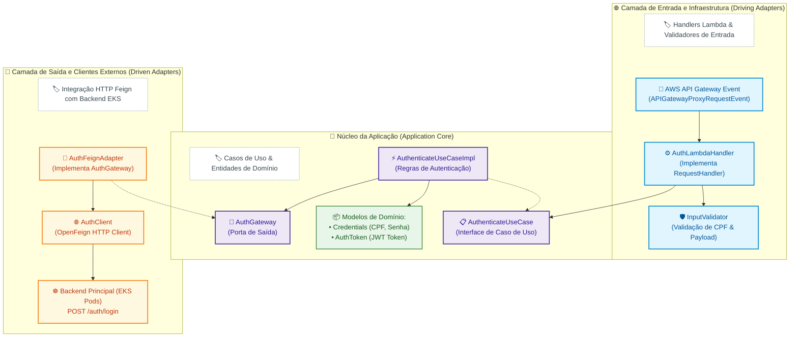
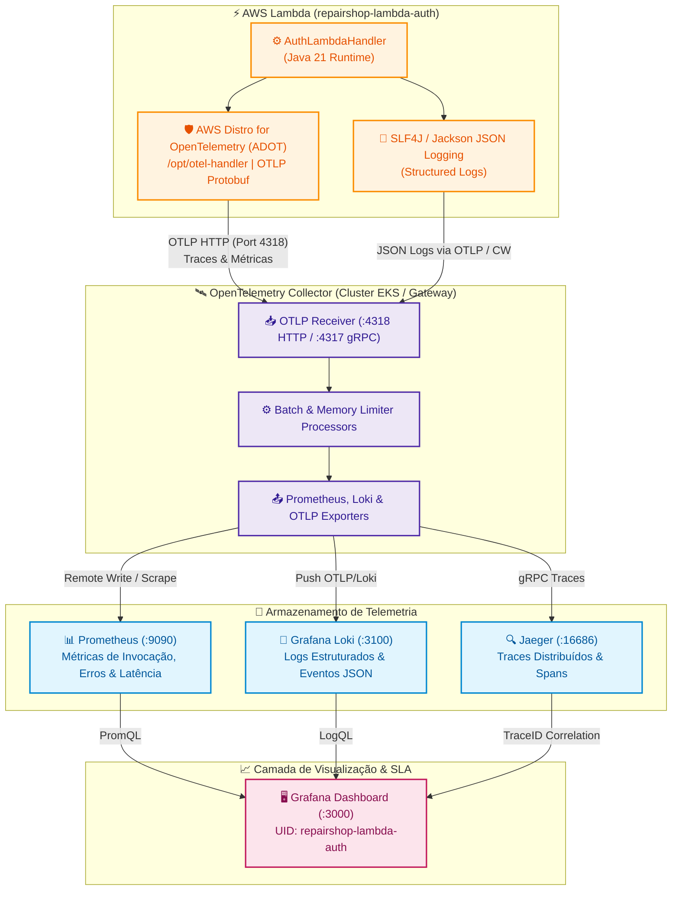
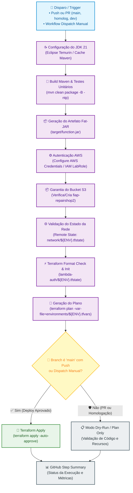
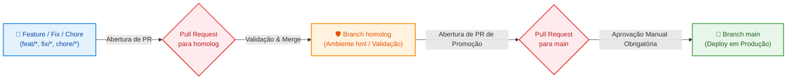

# ⚡ RepairShop — Microsserviço Serverless de Autenticação (AWS Lambda Java 21)

[](https://openjdk.org/)
[](https://aws.amazon.com/lambda/)
[](https://blog.cleancoder.com/uncle-bob/2012/08/13/the-clean-architecture.html)
[](https://github.com/OpenFeign/feign)
[](https://opentelemetry.io/)
[](https://grafana.com/)
[](https://prometheus.io/)
[](https://grafana.com/oss/loki/)
[](https://www.terraform.io/)
[](https://github.com/features/actions)

Repositório da **Função Serverless (AWS Lambda)** em **Java 21**, desenvolvida sob os preceitos de **Clean Architecture (Arquitetura Limpa / Hexagonal)**, responsável pela validação defensiva de credenciais (CPF), verificação de status do cliente e emissão de tokens JWT para o ecossistema **RepairShop** (FIAP Tech Challenge — Fase 3).

---

## 🎯 Propósito e Escopo Arquitetural

Conforme especificado no edital da Fase 3, a autenticação de clientes e operadores foi desacoplada em uma solução Serverless independente para prover:

- **Autenticação via CPF:** Validação estrita de formato e dígito verificador do CPF antes de qualquer chamada downstream.
- **Consulta e Emissão de Token JWT:** A Lambda atua como intermediário seguro, validando as credenciais e emitindo o token assinado necessário para consumo das rotas protegidas da API principal.
- **Isolamento de Infraestrutura e Rede:** A função Lambda é provisionada em sub-redes privadas da VPC com Security Group próprio (`aws_security_group.lambda_sg`), permitindo tráfego de saída controlado.
- **Respostas Padronizadas com Headers OWASP:** Todas as respostas contêm headers de proteção (`Strict-Transport-Security`, `X-Content-Type-Options`, `X-Frame-Options`, `Cache-Control`).

---

## 🏗️ Arquitetura de Software (Clean Architecture / Hexagonal)

A aplicação segue a divisão em camadas independentes de frameworks externos:



---

## 📋 Contrato da API (`POST /auth/login`)

### Exemplo de Payload de Requisição
```json
{
  "cpf": "123.456.789-00",
  "password": "SenhaSegura123!"
}
```

### Exemplo de Resposta de Sucesso (`200 OK`)
```json
{
  "token": "eyJhbGciOiJIUzI1NiIsInR5cCI6IkpXVCJ9...",
  "type": "Bearer",
  "expiresIn": 86400,
  "cpf": "12345678900"
}
```

---

## 📊 Observabilidade Serverless: OpenTelemetry, Prometheus, Loki e Grafana

A função Lambda foi desenhada dentro dos padrões de **Observabilidade Cloud Native (OpenTelemetry / Three Pillars of Observability)**, garantindo telemetria completa (Métricas, Logs e Rastreamento Distribuído) com visualização unificada no **Grafana**.

### 🔄 Arquitetura de Extração e Fluxo de Telemetria



---

### 1. 📈 Extração de Métricas (OpenTelemetry ➔ Prometheus ➔ Grafana)

A camada **ADOT (AWS Distro for OpenTelemetry)** e os coletores exportam os *Golden Signals* do ambiente Serverless para o **Prometheus**:

| Métrica Coletada | Origem / Instrumentação | Expressão PromQL Utilizada no Grafana | Propósito Operacional |
| :--- | :--- | :--- | :--- |
| **Total Invocations** | OTel / CloudWatch Lambda Metric | `sum(aws_lambda_invocations_sum{function_name=~"repairshop-lambda-auth.*"}) or sum(http_server_requests_seconds_count{uri=~"/auth/login.*"})` | Mede a vazão instantânea de tentativas de login. |
| **Error Rate (%)** | OTel Errors Counter | `(sum(rate(aws_lambda_errors_sum[5m])) / (sum(rate(aws_lambda_invocations_sum[5m])) or vector(1))) * 100` | Taxa de falhas de autenticação com thresholds dinâmicos (Verde <1%, Amarelo 1-5%, Vermelho >5%). |
| **Avg Execution Duration** | OTel Duration Histogram | `avg(aws_lambda_duration_milliseconds_sum / (aws_lambda_duration_milliseconds_count or vector(1)))` | Latência média do ciclo completo da Lambda em milissegundos. |
| **Throttles** | AWS Lambda Concurrency Metric | `sum(aws_lambda_throttles_sum{function_name=~"repairshop-lambda-auth.*"})` | Alerta imediato sobre estouro de cota ou concorrência esgotada da função. |
| **Tacômetro de SLA (%)** | Prometheus Composite Gauge | `100 - ((sum(rate(aws_lambda_errors_sum[5m])) / (sum(rate(aws_lambda_invocations_sum[5m])) or vector(1))) * 100)` | Tacômetro de visualização imediata do SLA de disponibilidade (Target: 99.0%). |
| **Percentis de Latência (p50, p95, p99)** | OTel Histogram Bucket | `histogram_quantile(0.99, sum by (le) (rate(http_server_requests_seconds_bucket{uri=~"/auth/login.*"}[1m]))) * 1000` | Avalia o comportamento de cauda (*tail latency*) e impacto de *cold starts* em p99. |
| **Downstream HTTP Latency** | Feign Client OpenTelemetry Span | `avg(http_server_requests_seconds_sum{uri=~"/auth/login.*"} / (http_server_requests_seconds_count{uri=~"/auth/login.*"} or vector(1))) * 1000` | Isola o tempo de roundtrip da chamada Feign ao backend EKS do tempo total da Lambda. |
| **Concurrent Containers** | OTel Concurrency Gauge | `sum(aws_lambda_concurrent_executions_sum{function_name=~"repairshop-lambda-auth.*"})` | Número de instâncias/containers quentes em execução simultânea. |

---

### 2. 📜 Extração e Ingestão de Logs (SLF4J ➔ OpenTelemetry ➔ Grafana Loki)

O `AuthLambdaHandler` utiliza logs estruturados em formato JSON com mascaramento estrito de dados sensíveis (conformidade com a LGPD):

1. **Mascaramento e Sanitização Defensiva:**
   - O CPF é registrado apenas com o formato sanitizado de auditoria (`123.***.***-00`), impedindo vazamento de dados de identificação pessoal em logs abertos.
   - Credenciais e senhas **nunca** são escritas em log (`Credentials.password` nunca entra nas interpolações SLF4J).
2. **Encaminhamento para o Grafana Loki:**
   - O OTel Collector formata as linhas de log com tags indexadas (`job="repairshop-lambda-auth"`, `environment="prd"`, `level="INFO|WARN|ERROR"`).
   - O Grafana permite consulta via **LogQL**:
     ```logql
     # Consulta geral de logs estruturados em JSON
     {job=~"repairshop.*|.*auth.*"} | json

     # Filtro exclusivo de falhas e erros operacionais
     {job=~".*auth.*"} |= "❌"

     # Filtro de avisos de validação defensiva (ex: CPF com formato inválido)
     {job=~".*auth.*"} |= "⚠️"
     ```

---

### 3. 🔍 Rastreamento Distribuído (Distributed Tracing via W3C TraceContext)

Para garantir visibilidade ponta a ponta quando um cliente solicita autenticação, a Lambda atua como o primeiro nó da cadeia de execução distribuída:

```text
[Cliente / API Gateway]
        │
        ▼ (POST /auth/login)
[AWS Lambda (AuthLambdaHandler)]  <── Inicia o Trace (Gera TraceID & SpanID)
        │
        │ Injeta cabeçalho: "traceparent: 00-4bf92f3577b34da6a3ce929d0e0e4736-00f067aa0ba902b7-01"
        ▼ via OpenFeign HTTP Client
[Backend Core App (Pods EKS)]     <── Continua o Trace (Child Span)
        │
        ▼
[PostgreSQL Database (RDS)]       <── SQL Query Span
```

- **Propagação de Contexto:** Configurado nativamente via `OTEL_PROPAGATORS="tracecontext,baggage"`.
- **Correlação Biunívoca:** No Grafana, ao inspecionar uma linha de log com erro no Loki, o operador clica diretamente em **"View Trace"** e é direcionado para a árvore completa no **Jaeger**, permitindo identificar se a lentidão ocorreu no runtime da Lambda (ex: *cold start*), na rede da VPC ou na consulta SQL downstream.

---

### 4. 🎛️ Dashboard Operacional no Grafana (`repairshop-lambda-auth`)

O ecossistema disponibiliza o dashboard pronto para uso importado automaticamente no Grafana:

- **Dashboard UID:** `repairshop-lambda-auth`
- **Arquivo de Origem:** [`tech-challenge-repairshop-app/observability/grafana/dashboards/repairshop-lambda-auth.json`](https://github.com/fiap-postech-repairshop/tech-challenge-repairshop-app/blob/main/observability/grafana/dashboards/repairshop-lambda-auth.json)
- **Provisionamento Declarativo no EKS:** Mapeado automaticamente através do ConfigMap `grafana-dashboards-config` ([`k8s/configs/grafana-dashboards-config.yaml`](https://github.com/fiap-postech-repairshop/tech-challenge-repairshop-app/blob/main/k8s/configs/grafana-dashboards-config.yaml)).

#### Painéis Disponíveis no Dashboard:
1. **Serverless Golden Signals:** Cards de status em tempo real com Total Invocations, Error Rate (%), Avg Execution Duration (ms) e Throttles.
2. **Tacômetros de Performance:** Indicadores circulares (*Gauges*) para Invocations Success Rate (%) e Duração de Execução com limites operacionais pré-estabelecidos.
3. **Curvas de Percentil de Latência (p50, p95, p99):** Gráficos temporais para identificação de oscilações e degradação de performance.
4. **Isolamento de Latência Downstream:** Comparativo entre o tempo gasto no processamento interno da Lambda e o roundtrip do Feign Client para a API principal.
5. **Painel Interativo de Logs ao Vivo (Loki):** Console de logs em tempo real integrado, permitindo expandir detalhes de JSON, filtrar mensagens e saltar diretamente para os traces correlacionados.

---

## 🗂️ Estrutura de Arquivos

```text
.
├── .github/workflows/
│   ├── ci-cd-lambda.yml      # Pipeline de CI/CD (Build Java, Testes e Deploy Terraform)
│   └── destroy.yml           # Pipeline de destruição controlada com Safety Gate
├── infra/
│   ├── main.tf               # Definição da AWS Lambda, Security Group e IAM Roles
│   ├── variables.tf          # Variáveis de ambiente, timeout e memória
│   ├── outputs.tf            # Export de Lambda ARN, Name e SG ID
│   ├── providers.tf          # Configuração do provedor AWS
│   ├── backend.tf            # Configuração do backend remoto S3
│   └── environments/
│       ├── dev.tfvars        # Configurações de Dev
│       ├── hml.tfvars        # Configurações de Homolog
│       └── prd.tfvars        # Configurações de Produção
├── src/
│   ├── main/java/com/cao/repairshop/auth/
│   │   ├── application/      # UseCases, Interfaces de Gateway e Regras
│   │   ├── domain/           # Entidades, Models e Exceptions
│   │   └── infra/            # Handlers Lambda, Validadores e Clientes Feign
│   └── test/java/            # Testes Unitários e Runner Local
├── pom.xml                   # Dependências e configuração do maven-shade-plugin
└── README.md
```

---

## 🚀 Pipeline de CI/CD (GitHub Actions)

A esteira automatizada está configurada em [`.github/workflows/ci-cd-lambda.yml`](.github/workflows/ci-cd-lambda.yml).

### Desenho da Pipeline CI/CD



### Detalhamento e Justificativa de Cada Passo da Pipeline

| Passo | Ação Executada | Justificativa Arquitetural |
| :--- | :--- | :--- |
| **1. Set up JDK 21** | Configura o ambiente Java 21 (Temurin) com cache do Maven. | Reduz o tempo de download de dependências e garante conformidade de compilação. |
| **2. Compile and Test Application** | Executa `mvn clean package -B -ntp` rodando toda a suíte de testes unitários. | Garante que código quebrado ou sem testes nunca alcance o ambiente de deploy. |
| **3. Upload/Download Artifact** | Gera e compartilha o `target/function.jar` otimizado via `maven-shade-plugin`. | Cria um artefato imutável (*fat-jar*) contendo todas as dependências embutidas para o runtime serverless. |
| **4. Configure AWS Credentials** | Autentica no ambiente AWS com credenciais temporárias do `LabRole`. | Estabelece credenciais com privilégios adequados para criação de funções Lambda e Security Groups. |
| **5. Check Remote Network State** | Valida se a VPC e sub-redes privadas já existem no bucket S3. | Previne erros de deployment ao garantir que as dependências de rede estejam disponíveis. |
| **6. Terraform Format & Init** | Valida a sintaxe e conecta ao estado isolado `lambda-auth/${ENV}.tfstate`. | Mantém a rastreabilidade do estado da Lambda desacoplado dos demais serviços. |
| **7. Terraform Plan** | Gera a simulação exata de criação/atualização da função Lambda. | Valida se variáveis como `APP_BASE_URL` e configurações de timeout estão corretas. |
| **8. Terraform Apply** | Executa o upload do binário e provisionamento na AWS Lambda. | Deploy automatizado exclusivo para a branch `main` ou disparo manual aprovado. |
| **9. Generate Summary** | Exporta relatório com versão Java, ambiente e status no `$GITHUB_STEP_SUMMARY`. | Visibilidade operacional rápida para o time de desenvolvimento. |

### 💡 Decisão de Arquitetura: Otimização de Jobs e Economia de Quota do GitHub

> **Decisão Arquitetural:** O pipeline foi estruturado para **minimizar o tempo de execução e o consumo de minutos do GitHub Actions**.
> 
> **Motivação Técnica:**
> 1. **Execução Enxuta e Rápida:** A compilação do micro-artefato Java e o deploy via Terraform levam menos de 2 minutos no total.
> 2. **Economia de Minutos na Conta:** O uso eficiente de cache do Maven (`cache: maven`) e a eliminação de passos redundantes reduzem drasticamente o uso da cota mensal gratuita de runners.

---

### 🔐 Secrets do GitHub Actions (AWS Academy & Deploy)

Para que a pipeline de CI/CD execute a compilação Java e o provisionamento da infraestrutura Serverless via Terraform, o repositório requer as seguintes **Actions Secrets** (*Settings > Secrets and variables > Actions*):

> [!TIP]
> Em contas da **AWS Academy**, as credenciais são temporárias (sessões de 3 a 4 horas). Por essa razão, a inclusão do `AWS_SESSION_TOKEN` é mandatória para autenticação da role `LabRole` e prevenção de falhas de `ExpiredToken`.

| Secret | Obrigatório | Descrição |
| :--- | :---: | :--- |
| `AWS_ACCESS_KEY_ID` | **Sim** | Chave de acesso temporária fornecida no console do AWS Academy. |
| `AWS_SECRET_ACCESS_KEY` | **Sim** | Chave secreta de acesso correspondente. |
| `AWS_SESSION_TOKEN` | **Sim** | Token da sessão temporária (necessário para o `LabRole`). |

💡 *Dica de Automação:* Utilize o script [`update_aws_secrets.ps1`](https://github.com/tech-challenge-fiap-repairshop/tech-challenge-wiki-docs/blob/main/update_aws_secrets.ps1) disponível no repositório `tech-challenge-wiki-docs` para atualizar essas credenciais em todos os 7 repositórios da organização simultaneamente via GitHub CLI.

---

### 🌐 Variáveis de Ambiente e Terraform Inputs

| Variável / Parâmetro | Origem / Localização | Valor Padrão | Descrição |
| :--- | :--- | :--- | :--- |
| `AWS_REGION` | Pipeline `env` / Terraform | `us-east-1` | Região da AWS para deploy da função Lambda. |
| `JAVA_VERSION` | Pipeline `env` | `21` | Versão do OpenJDK para compilação do fat-JAR. |
| `APP_BASE_URL` | `environments/*.tfvars` | DNS interno EKS | Endpoint base da API principal para chamadas do Feign Client. |
| `S3_TFSTATE_BUCKET` | Backend S3 / Workflow | `fiap-repairshop2` | Bucket S3 para armazenamento do estado `lambda-auth/${ENV}.tfstate`. |

---

## 🔀 Governança de Branches e Ciclo de Promoção (Git Flow)

A governança do repositório segue isolamento estrito com aprovação controlada para promoção de ambientes:



> ⚠️ **Regra de Governança:** É expressamente proibido commit ou push direto na branch `main`. Toda alteração deve passar pelo pipeline de validação e aprovação formal.

---

## 💻 Como Executar e Testar Localmente

### 1. Testes Unitários e Empacotamento via Maven
```bash
mvn clean test
mvn clean package
```

### 2. Execução Local via Runner
O projeto inclui a classe de teste [`LocalLambdaRunner`](file:///c:/Users/Alexandre-AGAMIN/Projetos-%20FIAP/github-organizations-projects/tech-challenge-repairshop-lambda-auth/src/test/java/com/cao/repairshop/auth/LocalLambdaRunner.java) que simula o recebimento de eventos do API Gateway:
```bash
mvn test -Dtest=LocalLambdaRunner
```

### 3. Deploy Local via Terraform CLI
```bash
cd infra

terraform init \
  -backend-config="bucket=fiap-repairshop2" \
  -backend-config="key=lambda-auth/dev.tfstate" \
  -backend-config="region=us-east-1"

terraform plan -var-file="environments/dev.tfvars"
terraform apply -var-file="environments/dev.tfvars"
```

---

## 🔗 Links e Integrações no Ecossistema

- **Swagger UI da API:** [http://localhost:8080/swagger-ui/index.html](http://localhost:8080/swagger-ui/index.html)
- **Coleção Postman:** [`tech-challenge-repairshop-app/docs/postman/`](file:///c:/Users/Alexandre-AGAMIN/Projetos-%20FIAP/github-organizations-projects/tech-challenge-repairshop-app/docs/postman/)
- **Repositórios Relacionados:**
  - [`tech-challenge-repairshop-infra-apigateway`](https://github.com/fiap-postech-repairshop/tech-challenge-repairshop-infra-apigateway) (API Gateway que invoca esta Lambda)
  - [`tech-challenge-repairshop-app`](https://github.com/fiap-postech-repairshop/tech-challenge-repairshop-app) (Aplicação principal com validação JWT)
  - [`tech-challenge-repairshop-infra-network`](https://github.com/fiap-postech-repairshop/tech-challenge-repairshop-infra-network) (Sub-redes Privadas)
  - [`tech-challenge-repairshop-infra-db-rds`](https://github.com/fiap-postech-repairshop/tech-challenge-repairshop-infra-db-rds) (Banco de Dados PostgreSQL)
